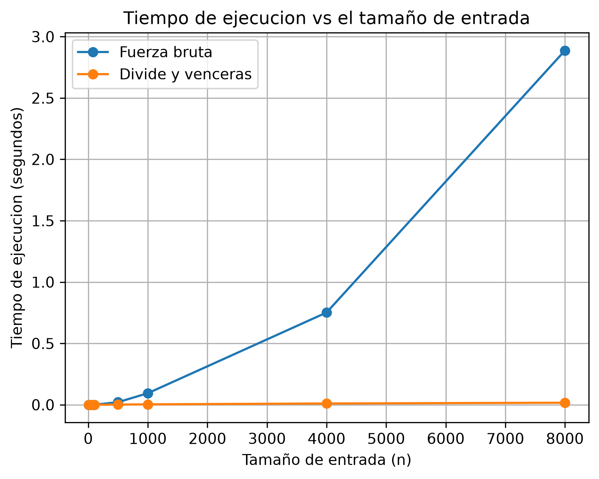

# Curso de Análisis de Algoritmos 2026-1
## Laboratorio evaluativo 02 — Dividir y vencer
### Estudiante: Sofia Villa Muñoz


## Instrucciones para reproducir el experimento
Para reproducir correctamente el entorno del laboratorio, siga los siguientes pasos:

1. Abra una terminal dentro de la carpeta lab2-divide-y-vencer y cree el entorno virtual:
### Windows
```bash
    python -m venv venv
    venv\Scripts\activate
```
### Linux / macOS
```bash
    python3 -m venv venv
    source venv/bin/activate    
```

2. Con el entorno virtual activado, instale las dependencias del proyecto mediante el archivo requirements.txt:
```bash
    pip install -r requirements.txt
```

3. Ejecute el archivo pruebas.py para validar el correcto funcionamiento de los métodos:
```bash
    python pruebas.py
```

4. Ejecute el archivo de medicion.py para las mediciones de tiempo y generación de la gráfica "Tiempo vs n":
```bash
    python medicion.py
```

## Parte 1 — Validación de soluciones y casos cubiertos.

### Algoritmo subarreglo: [subarreglo.py](subarreglo.py)
### Pruebas: [pruebas.py](pruebas.py)

Se implementaron dos soluciones para encontrar el subarreglo de mayor suma: una mediante fuerza bruta y otra mediante divide y vencerás. Ambas fueron validadas con el archivo de [pruebas.py](pruebas.py), las cuales resultaron esenciales para comprobar el comportamiento de las soluciones antes de llevar a cabo las mediciones del rendimiento. 

Para ello, se utilizaron instrucciones assert, que comprueban si la suma obtenida coincide con el resultado esperado. Se evaluaron los siguientes seis casos:

1. Serie del enunciado: se utilizó la serie [-3, 5, -2, 8, -6, 3, 9, -4] para comprobar que ambos algoritmos identifican una suma máxima de 17, correspondiente al tramo comprendido entre los días 2 y 7.

2. Serie con un solo elemento: se evaluó la lista [7] para verificar que ambos algoritmos reconocen que el único elemento constituye el mejor subarreglo y que su suma máxima es 7. Este caso comprueba el comportamiento de la condición base de la solución recursiva.

3. Serie con todos los valores negativos: se utilizó la lista [-5, -2, -8, -3] para comprobar que ambos algoritmos seleccionan el elemento menos negativo, -2, en lugar de devolver una suma incorrecta o asumir que la mejor suma es cero.

4. Serie con todos los valores positivos: se probó la lista [2, 4, 1, 3] para verificar que la suma máxima es 10, resultado de acumular todos los elementos de la serie.

5. Mejor subarreglo que cruza el punto medio: se utilizó la lista [-5, 4, -1, 3, -2] para comprobar que ambos algoritmos encuentran la suma máxima de 6, correspondiente al tramo [4, -1, 3]. Este caso permite verificar que divide y vencerás considera correctamente los subarreglos que comienzan en una mitad y terminan en la otra.

6. Listas aleatorias: se generaron 20 listas de longitudes entre 1 y 30, con valores enteros entre -100 y 100. Se fijó la semilla aleatoria en 42 para que las pruebas puedan reproducirse con los mismos datos. En cada lista se compararon las sumas máximas obtenidas por ambos algoritmos, comprobando que coincidan.

## Parte 2 — Gráfica "Tiempo vs n" y medición
### Medición y gráfica: [medicion.py](medicion.py)



Para analizar el comportamiento de los algoritmos, se midió su tiempo de ejecución mediante listas de diferentes tamaños, entre ellos 10, 50, 100, 500, 1000, 4000 y 8000 elementos. En donde cada lista se generó con valores enteros aleatorios entre -100 y 100 mediante la función random.randint(-100, 100). Además, se hizo uso de una semilla fija 42 utilizando random.seed(SEMILLA), de modo que los datos se puedan generar nuevamente en futuras ejecuciones. 

El experimento recorre los tamaños mediante un ciclo for. Para cada lista, primero se ejecutan ambos algoritmos y se verifica mediante un assert que sus resultados coincidan. Después se mide el tiempo de ejecución de cada uno utilizando time.perf_counter(), registrando el tiempo antes y después de una única llamada al algoritmo. Los tiempos obtenidos se almacenan para posteriormente generar la gráfica de tiempo de ejecución en función del tamaño de entrada n.

Por último, cada medición se realizó una sola vez por algoritmo y por tamaño de entrada, sin repetir las ejecuciones para calcular un promedio.

## Parte 3 — Análisis

### 1. Recurrencia

La función subarreglo_maximo se encarga de dividir la lista en dos mitades, buscando el subarreglo de mayor suma en tres posibilidades: completamente en la mitad izquierda, en la derecha o cruzando el punto medio.Generando dos subproblemas de un tamaño aproximado de n/2, cada uno con un costo de T(n/2), luego calcula el mejor subarreglo cruzado, cuyo costo es de Θ(n), con una recurrencia de: T(n) = 2T(n/2) + Θ(n). 

Para resolver esta recurrencia se hace uso del metodo maestro, identificando las siguientes variables, a=2, b=2 y f(n) = Θ(n). Luego calculamos n^(log_b(a)) = n^(log_2(2)) = n

Como f(n) = Θ(n) tienen el mismo orden que n^(log_b(a)), se cumple el caso 2 del método maestro, por lo que T(n) = Θ(n log n). Mientras que en el algoritmo de fuerza bruta se acumula la suma a medida que avanza, de tal modo que para una lista de tamaño (n), examina (n(n+1)/2) subarreglos contiguos. Como el término dominante de esta expresión es n², su complejidad es Θ(n²).

### 2. Lo medido contra lo esperado

En la gráfica se visualiza que al aumentar el tamaño entrada (n), el algoritmo de fuerza bruta presenta un crecimiento más rapido que el de Divide y venceras. Un claro ejemplo, se visualiza con los tamaños de n = 4000 y n = 8000, donde se duplica la entrada. En fuerza bruta, el tiempo pasa de 0,751966 a 2,886938 segundos, multiplicándose por 3,84. Mientras que en divide y venceras, pasó de 0,010334 a 0,016569 segundos, multiplicándose por 1,60.

Estos resultados se aproximan a lo esperado teoricamente, donde para Θ(n²), el tiempo se multiplca aproximadamente por 4 al duplicar n, mientras que para Θ(n log n), el factor es cercano a 2. Donde las diferencias se deben posiblemente a condiciones de ejecucion y de posibles variaciones en el tiempo medido.

